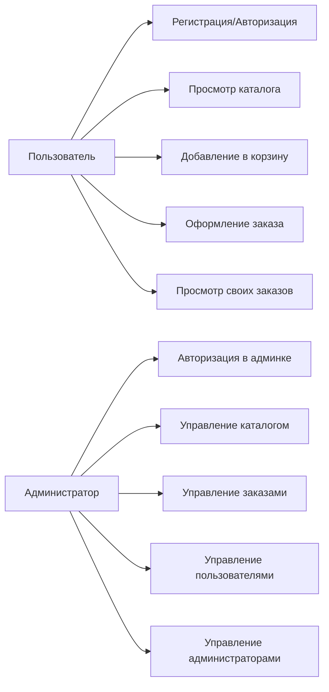
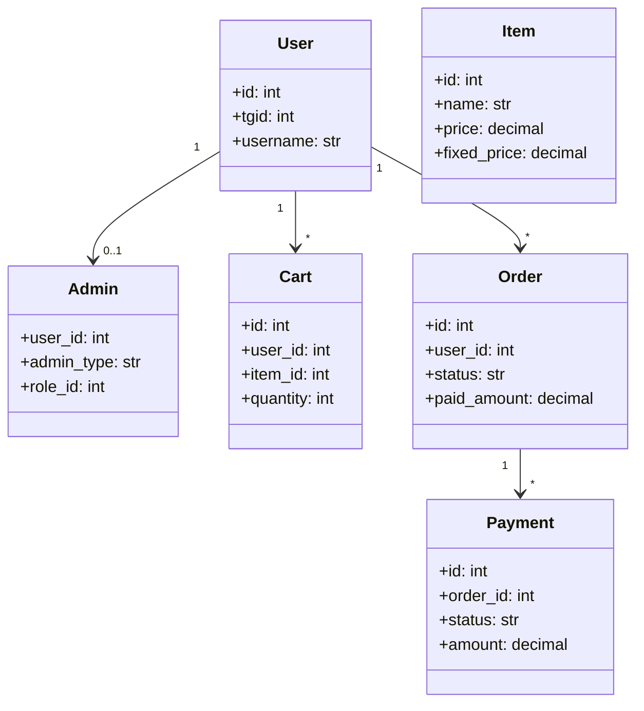
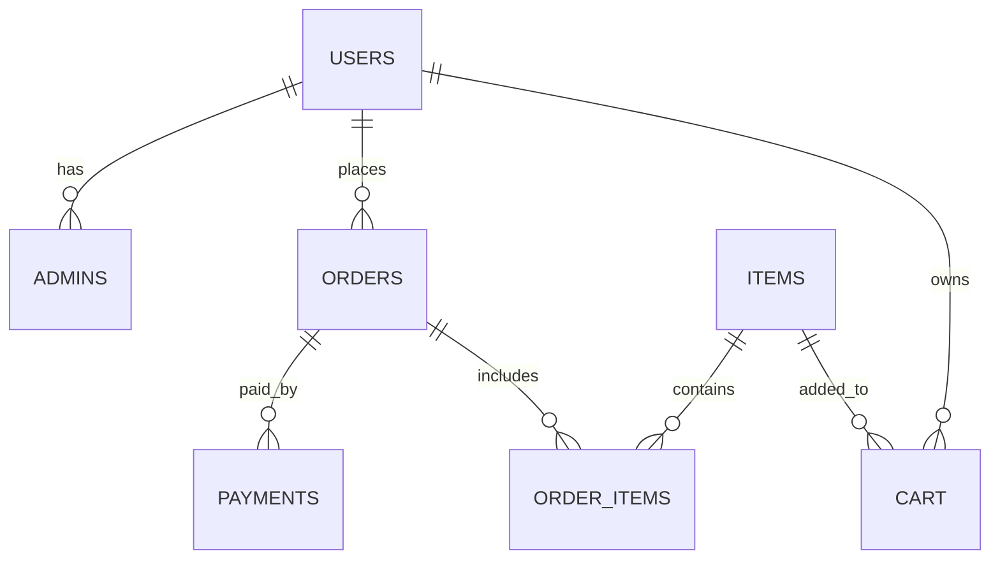

# КУРСОВОЙ ПРОЕКТ  
**Тема:** Разработка веб-приложения интернет-магазина `StoreKPLite`

---

## Титульный лист

**Студент:** Спинко Ренат Дмитриевич  
**Группа:** П30  
**Дисциплина:** Веб-разработка  
**Год:** 2026

---

## Содержание

1. [Введение](#введение)  
2. [Глава 1. Анализ предметной области и постановка задачи](#глава-1-анализ-предметной-области-и-постановка-задачи)  
3. [Глава 2. Проектирование системы](#глава-2-проектирование-системы)  
4. [Глава 3. Реализация и результаты](#глава-3-реализация-и-результаты)  
5. [Тестирование](#тестирование)  
6. [Заключение](#заключение)  
7. [Приложение А. Исходный код](#приложение-а-исходный-код)  
8. [Приложение Б. Скриншоты работы](#приложение-б-скриншоты-работы)  

---

## Введение

Целью курсового проекта является разработка учебного веб-приложения интернет-магазина с разделением прав доступа для обычного пользователя и администратора.  

В ходе выполнения проекта была создана система `StoreKPLite`, включающая:
- клиентскую часть магазина;
- административную панель;
- backend API на микросервисной архитектуре;
- интеграцию с платежами и Telegram-ботом;
- контейнеризацию через Docker Compose для локального запуска.

Актуальность темы обусловлена тем, что интернет-магазины являются распространенным типом информационных систем, в которых присутствуют ключевые задачи веб-разработки: авторизация, каталог товаров, корзина, оформление заказов, управление сущностями через админку, работа с API и БД.

---

## Глава 1. Анализ предметной области и постановка задачи

### 1.1 Предметная область

Предметная область — электронная коммерция.  
Система должна обеспечивать:
- публикацию и отображение каталога товаров;
- выбор товаров и формирование заказа пользователем;
- хранение данных пользователей и заказов;
- администрирование каталога, заказов и аккаунтов.

Ключевые объекты предметной области:
- **Пользователь**: регистрируется, авторизуется, оформляет заказы;
- **Администратор**: управляет данными магазина;
- **Товар**: карточка, фото, параметры, цена;
- **Заказ**: состав, статус, платежная информация;
- **Каталог**: набор товаров и группировки.

Основные процессы:
1. Пользователь просматривает каталог и карточки товаров;
2. Добавляет товар в корзину;
3. Оформляет заказ и производит оплату;
4. Администратор обрабатывает заказ и изменяет статусы;
5. Администратор поддерживает актуальность каталога и данных пользователей.

### 1.2 Неформальная постановка задачи

Необходимо разработать веб-приложение интернет-магазина, которое поддерживает два режима работы:
- **режим пользователя**: просмотр каталога, работа с корзиной, оформление заказов;
- **режим администратора**: управление каталогом, заказами, администраторами и пользователями.

Система должна запускаться локально в контейнерах, быть понятной для демонстрации на защите и соответствовать базовому варианту курсового проекта по тематике интернет-магазина.

### 1.3 Выбранный стек технологий

- **Архитектура:** frontend + backend API;
- **Frontend:** React (`miniapp_tg`);
- **Админка:** React (`admin_react`);
- **Backend:** Python + FastAPI (`users`, `products`, `finance`, `delivery`, `support`);
- **СУБД:** PostgreSQL;
- **Кэш/сессии:** Redis;
- **Контейнеризация:** Docker, Docker Compose;
- **Reverse proxy:** Nginx;
- **Дополнительно:** Telegram bot + bot API bridge.

---

## Глава 2. Проектирование системы

### 2.1 Проектирование backend-компонентов

Серверная часть разделена на сервисы:
- `users-service` — пользователи, админ-авторизация, роли/права;
- `products-service` — каталог, корзина, заказы;
- `finance-service` — платежи и финансовые операции;
- `delivery-service` — методы доставки и данные доставки;
- `support-service` — вспомогательные сущности поддержки.

Такое разделение позволяет логически изолировать зоны ответственности и упрощает сопровождение.

### 2.2 Проектирование frontend-компонентов

Пользовательская часть содержит:
- экран каталога;
- карточку товара;
- корзину;
- страницу оформления заказа;
- список заказов и профиль.

Административная часть содержит:
- раздел каталога;
- раздел заказов;
- раздел администраторов;
- раздел пользователей.

### 2.3 Use Case диаграмма



### 2.4 Диаграмма классов и сущностей



### 2.5 Диаграмма базы данных



---

## Глава 3. Реализация и результаты

### 3.1 Реализованный функционал пользователя

- просмотр каталога и карточек товаров;
- добавление/удаление товаров в корзине;
- оформление заказа;
- отображение заказов пользователя;
- работа с профилем.

### 3.2 Реализованный функционал администратора

- вход в административную панель;
- управление товарами каталога;
- управление заказами и их статусами;
- управление пользователями;
- управление учетными записями администраторов и ролями.

### 3.3 Архитектурные и технические особенности

- локальный запуск всего проекта через `docker-compose.kp-local.yml`;
- разделение frontend/backend и сервисов;
- защищенные маршруты админки;
- минимизированный публичный периметр без лишних модулей;
- упрощенная модель ценообразования с фиксированной ценой товара.

### 3.4 Инструкция запуска

```bash
cd StoreKPLite
cp .env.example .env
docker compose -f docker-compose.kp-local.yml --env-file .env up -d --build
```

После запуска:
- магазин: `http://127.0.0.1/miniapp/`
- админка: `http://127.0.0.1/x9d4k2m7p1/admin/`

---

## Тестирование

В рамках проекта проведено функциональное ручное тестирование основных пользовательских сценариев.

Примеры проверок:
1. Авторизация пользователя и отображение профиля;
2. Добавление товара в корзину и изменение количества;
3. Оформление заказа и создание записи в заказах;
4. Авторизация администратора;
5. Изменение статуса заказа в админке;
6. Создание/редактирование товара в каталоге;
7. Управление пользователями и администраторами.

Результат: критических дефектов, препятствующих базовой демонстрации функционала, не выявлено.

---

## Заключение

В ходе выполнения курсового проекта разработано полноценное учебное веб-приложение интернет-магазина `StoreKPLite`, соответствующее требованиям базового варианта темы.

Реализованы пользовательский и административный контуры, спроектирована структура данных, выполнена контейнеризация и подготовлена система к локальному запуску и демонстрации.

Поставленные цели достигнуты: создана рабочая информационная система, охватывающая основные процессы интернет-магазина и пригодная для дальнейшего развития.

---

## Приложение А. Исходный код

Исходный код проекта находится в каталоге:

- `StoreKPLite/` — полный проект;
- ключевые подпроекты: `miniapp_tg`, `admin_react`, `api`, `nginx`, `bot_tg`, `bot_api_service`.


